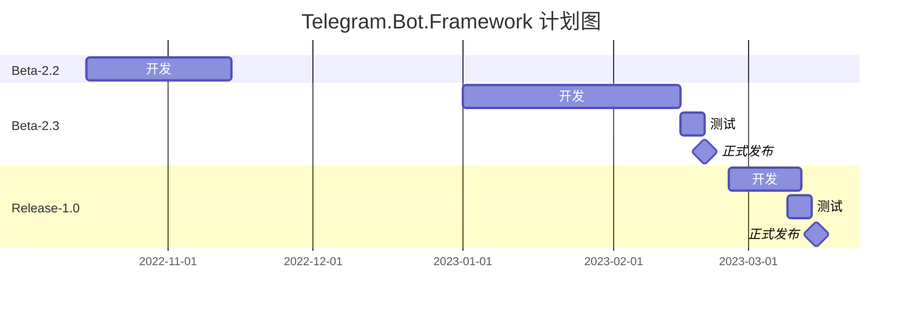

# Telegram.Bot.Framework


### Release-1.0实现的目标

* 用户桥功能
* 频道管理
* 群组管理
* 基础Bot功能

### 简单介绍

[更多帮助和使用指南，请访问WIKI](https://github.com/sokushu/Telegram.Bot.Net/wiki)

这是一个可以帮助减少Telegram Bot开发难度的框架，仿照了ASP.NET的方式，如果你会一点ASP.NET，那么你也可以轻松上手这个框架。

### 快速开始

```csharp
public class TestCommands : TelegramController
{
    private readonly IServiceProvider serviceProvider;
    public Commands(IServiceProvider serviceProvider)
    {
        this.serviceProvider = serviceProvider;
    }

    [Command("SayHello")]
    public async Task SayHello()
    {
        await SendTextMessage("Hello World");
    }
}
```

```csharp
public class TGBotDEV : IConfig
{
    static void Main(string[] args)
    {
        var Secrets = new ConfigurationBuilder().AddUserSecrets("98def42c-77dc-41cb-abf6-2c402535f4cb").Build();

        string Token = Secrets.GetSection("Token").Value;
        string Proxy = Secrets.GetSection("Proxy").Value;
        int Port = int.Parse(Secrets.GetSection("Port").Value);

        var bot = TelegramBotManger.CreateConfig()
            .SetToken(Token)
            .SetProxy(Proxy, Port)
            .SetConfig<TGBotDEV>()
            .SetBotName("DEV1")
            .Build();

        Task botTask = bot.Start();

        botTask.Wait();
    }

    public void Config(IServiceCollection telegramServices)
    {
        // TODO Something...
    }
}
```

### 目前开发中的已知问题

* [BUG] `/Admin` 指令，如果不使用用户权限认证，直接使用会导致异常发生

### 目前计划开发的内容

* 暂无
