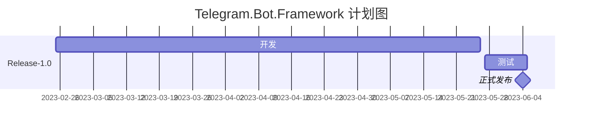

# Telegram.Bot.Framework


### Release-1.0实现的目标

* 用户桥功能
* 频道管理
* 群组管理
* 基础Bot功能

### 简单介绍

[更多帮助和使用指南，请访问WIKI](https://github.com/sokushu/Telegram.Bot.Net/wiki)

这是一个可以帮助减少Telegram Bot开发难度的框架，仿照了ASP.NET的方式，如果你会一点ASP.NET，那么你也可以轻松上手这个框架。

### 快速开始

* 控制器的编写：

```csharp
public class TestCommands : TelegramController
{
    [BotCommand("SayHello")]
    public async Task SayHello()
    {
        await SendTextMessage("Hello World");
    }
}
```

* 执行入口：

```csharp
public class Program
{
    public static void Main(string[] args)
    {
        ITelegramBot telegramBot = TelegramBotBuilder.Create()
                .AddToken("<Your Token>")
                .AddProxy("http://127.0.0.1:7890")
                .UseController()
                .Build();

        Task botTask = telegramBot.BotStart();
        botTask.Wait();
    }
}
```

### 目前开发中的已知问题

* 暂无

### 目前计划开发的内容

* 暂无
